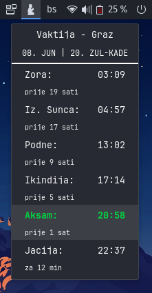

# vaktija-ascija.ba  

This is a GNOME Shell extension called "Vaktija" that displays daily prayer times of European cities which are a part of Bosnian Islamic Community in the panel menu.

## License

This program is licensed under the GNU General Public License version 2.0. For more details, please see the [GNU General Public License](http://www.gnu.org/licenses/) page.

## Requirements

- GNOME Shell 42

## Installation

1. Clone this repository or download the source code.
2. Run `./install.sh local-install`
3. Restart the GNOME Shell by pressing **Alt+F2** and entering `r` in the prompt, then press **Enter**.
4. Enable the extension using **GNOME Extensions** or by running `gnome-extensions enable vaktija@ascija.ba` in your terminal .

## Usage

After installing and enabling the extension, a new icon  will appear in the panel. Clicking on the icon will open a menu displaying the daily prayer times. Underneath is shown time before the next prayer and after the previous respectively. Current prayer/time is highlighted.  

  

## Further planned improvements

Following improvements and features are planned to be implamented in future:
- [ ] Preferences with following options:
  - [ ] All cities provided by [Vaktija.eu](https://vaktija.eu/), currently supports only Graz
  - [ ] All cities provided by [Vaktija.ba](https://vaktija.ba/)
  - [ ] Other cities in Europe
  - [ ] 12/24 time formats, currently only 24 hour format is supported 
- [x] Highlight current prayer time and show remaining time until next Prayer
- [ ] Add Desktop Background Widget
- [ ] Add Notifications X minutes before the prayer
- [x] Custom Translations via JSON file
- [x] Guide for Translation JSON file
- [x] Install script
- [x] Add Date and Islamic/Hijri Date
- [ ] Move to Notifications/Date & Time

## Acknowledgements

This extension is based on the work of [Vaktija.eu](https://vaktija.eu/) and [Vaktija.ba](https://vaktija.ba/) and inspired by their websites.
Vectors and icons inpired by [SVGRepo](https://www.svgrepo.com/svg/48266/muslim-man-praying).

## Contact

For any questions or feedback, please contact the extension author at maid.ascic@student.tugraz.at.  
For any feature request please submit an issue.  

## Notice

This project is following the **Atwood's law** which states: 
> Any application that can be written in JavaScript, will eventually be written in JavaScript. :rofl: :rofl:
